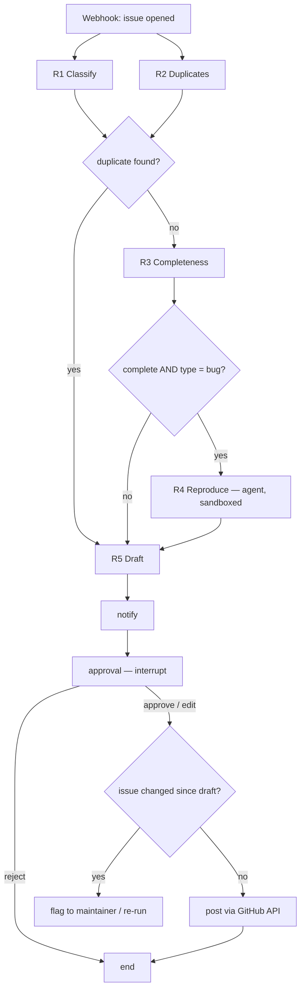

# GithubTriage — Design Notes

A running log of design decisions and *why* they were made.

---

## The method (use for every requirement)

1. **Map the manual process** — how does a human do it today?
2. **Dissect each step** — input, decision, output, cost of being wrong
3. **Pick the cheapest executor** — Rule → LLM call → Agent; does a Human need to sign off?
4. **Define the state** — what data flows between steps (Pydantic)
5. **Design the tools** — only for steps that must read/act on the outside world
6. **Wire the flow** — order, branches, parallelism, early exits, HITL
7. **Production lens** — failure modes, mitigations, eval metric

---

## 1. Manual process today

| # | Human step | Looks at | Output | Time |
|---|---|---|---|---|
| 1 | Classify type (bug / feature / question / docs) | Title, body | Type label | ~30s |
| 2 | Check for duplicates | Issue search, memory | "Duplicate of #N" or nothing | 1–5 min |
| 3 | Check completeness (version, repro, logs) | Body, template | "Please add X" or nothing | ~1 min |
| 4 | Try to reproduce | Local dev env | Confirmed / can't reproduce | 5–30 min |
| 5 | Judge severity + area | Codebase knowledge, report volume | Priority/area labels, assignee | ~1 min |
| 6 | Write a first reply | Docs, past issues | Comment | 2–5 min |

**Observations**
- Biggest time sinks: steps 2, 4, 6.
- Main output is a *comment + labels* → system produces a **draft** for maintainer approval.
- Flow has early exits (duplicate → stop; question → no reproduction). Paths depend on results, but the set of paths is small and known.

---

## 2. Per-requirement decisions

Template for each entry:

> **Input:** … **Decision:** … **Output:** … **Cost of error:** …
> **Executor:** Rule / LLM call / Agent / Human — *why*
> **Tools needed:** …
> **Production risks → mitigations:** …
> **Eval metric:** …

### R1. Classification
- **Input:** issue title + body. **Decision:** one of 4 fixed types. **Output:** type + confidence + short reasoning. **Cost of error:** low (human reviews), but a wrong type routes the issue down the wrong branch.
- **Executor:** Rule if an issue template was used; otherwise **one structured LLM call** (Pydantic `Literal` schema). Not an agent — nothing to look up, no step depends on an observation.
- **Tools needed:** none.
- **Production risks → mitigations:**
  - Ambiguous / mixed issues → allow `unclear`, route low confidence to human
  - Overconfident model → calibrate confidence against eval set
  - Prompt injection in body → delimit issue as data; classification never triggers writes on its own; HITL
  - Malformed output → native structured output + 1 retry + fallback to `unclear`
  - Cost at scale → small/cheap model is sufficient
- **Eval metric:** accuracy / macro-F1 vs. maintainer labels on 50–100 closed issues.

### R2. Duplicate finder
- **Input:** the new issue (title, body, and any error text), plus the index of past issues.
- **Decision:** is this the same bug as an existing issue? If so, which one?
- **Output:** `duplicate_of` (an issue number or none), plus a list of related issues and a short reason.
- **Cost of error:** a false duplicate is high (a real issue gets dismissed). A missed duplicate is medium (the maintainer does extra work).

```python
class DuplicateVerdict(BaseModel):
    duplicate_of: int | None  # None unless confident
    related: list[int]  # "possibly related", shown to maintainer
    reasoning: str
```

- **Executor:** split into 2 stages.
  - **Stage 1 — retrieve: code, not an LLM.** Embed the new issue, run hybrid search (keyword + vector), take the top 5. The issue text is the search query.
    - *Future enhancement (not in v1):* the LLM writes its own search queries in a loop. This helps only if searching with the raw issue text misses duplicates that a rewritten query would find (e.g. an issue titled "it's broken again 😡"). Start with the fixed search, measure recall@5, and only add an agentic retry loop if the eval shows misses that query rewriting would have fixed.
  - **Stage 2 — decide: one structured LLM call.** Give the model the new issue and the 5 candidates, and ask for a `DuplicateVerdict`. The prompt asks for the *same root cause*, not just the same topic, to favour precision.
  - **Human:** R6 approves the final comment.
- **Tools needed:** none. Stage 1 calls pgvector from application code, and Stage 2 is a single call with no tools. Nothing in R2 gives the LLM a tool.
- **Production risks → mitigations:**
  - Empty index for a new repo → backfill: fetch all past issues through the GitHub API and embed them once
  - Stale index (issues get edited or closed) → re-embed on the `issues.edited` and `issues.closed` webhooks
  - Switching embedding models → vectors from different models can't be compared; re-embed everything and store the model name with each vector
  - Long issues with huge stack traces → embed the title plus a cleaned body; store the error signature separately for keyword search
  - Prompt injection through old issues → retrieved issues are untrusted text too; put them in delimiters as data; the verdict can't close anything on its own (HITL does that)
  - Duplicate of a closed "won't fix" issue → keep state and labels as metadata so the response can say "this was discussed in #412 and declined"
  - Cost → embeddings are very cheap; most of the cost is the one Stage 2 LLM call per issue
- **Eval metric:**
  - Stage 1: recall@5 (is the true duplicate among the candidates?). Ground truth is free: issues maintainers closed as "Duplicate of #N".
  - Stage 2: precision on `duplicate_of`, reported together with the dataset composition.

### R3. Completeness check
- **Input:** issue body + issue type (from R1). The checklist depends on issue type, e.g. a feature request or question doesn't need logs.
- **Decision:** for each of version, repro steps and logs: `missing`, `vague` or `ok`, plus a `note` (e.g. "says 'latest' instead of a version number").
- **Output:** a `Completeness` object, written to shared state. R3 does not call HITL itself — the maintainer approves one combined draft in R6.
- **Cost of error:** low (maintainer reviews).

```python
class FieldCheck(BaseModel):
    status: Literal["missing", "vague", "ok"]
    note: str  # e.g. "says 'latest' instead of a version number"


class Completeness(BaseModel):
    version: FieldCheck
    repro_steps: FieldCheck
    logs: FieldCheck
```

- **Executor:**
  - **Template issues:** a rule (regex on template headings) marks absent fields as `missing`. For the fields that are present, one structured LLM call judges whether the content is useful. The LLM call is skipped only if every field is missing.
  - **Free-text issues:** one structured LLM call determines both presence and usefulness.
  - **Not an agent:** the flowchart is fixed in advance; the LLM only fills in the values being checked, and code decides the path.
- **Tools needed:** none.
- **Production risks → mitigations:**
  - Requesting data already given in prose → use the LLM (not just regex) for free text; test on real free-text issues
  - Treating "latest"/"master" as a valid version → the `vague` status handles this
  - Huge logs blowing up prompt size and cost → truncate logs to first and last N lines before passing to the LLM
  - Robotic checklist → R5 turns missing items into a polite, natural message
- **Eval metric:**
  - **Precision on `missing`/`vague`** (primary) — of all the times we said "missing", how often were we right? Low precision means nagging reporters in public.
  - Accuracy / macro-F1 (secondary).
  - **Dataset:** ~50 hand-labelled issues. Positives: issues where a maintainer asked for more info (`needs-info` / `waiting-for-response` labels, or comments like "can you provide more details on…"). Negatives: issues maintainers acted on without asking for anything (fixed or labelled directly). Without negatives, false nagging can't be measured. A 25 + 25 mix ensures both error types appear, but its precision is higher than production's — also report precision at the real class ratio.

### R4. Reproduction (sandbox) — via Agent
- **Input:** issue title + body, R1 type, R3 completeness.
- **Decision:** can the reported behaviour be reproduced, and with what script?
- **Output:** `ReproVerdict` — status, final script, `evidence_run_id`.
- **Cost of error:** low (human reviews).

- **Executor:** an agent inside a workflow.
  - **Why an agent:** the next action (fix an import, add an argument, change the input) must be *generated* from an open set of options, not *selected* from a small known set as in R3.
  - **Scope:** reproduce only — confirm the reported behaviour. Root-cause debugging is the maintainer's job.

```
[Rule gate] ──► is it a bug? has a snippet or clear steps? completeness OK?
    │ no ──► status = not_attempted (+ reason). No LLM cost.
    │ yes
    ▼
[ReAct agent] ── loop: write script → run in sandbox → read result → adjust
    │             (limits: max 5 runs, 2 min total, token budget)
    ▼
[Code check] ──► is the verdict backed by a real run? ──► write to shared state
```

- **Tools needed:**

| Tool | Arguments | Returns | Why it's designed this way |
|---|---|---|---|
| `run_python` | `code: str`, `version: Literal[...]` (only versions already built into images) | `exit_code`, `stdout`/`stderr` cut to 5KB, `duration`, `run_id` | The only tool that does something. It runs in the hardened sandbox |
| `submit_verdict` | `ReproVerdict` | — | Ends the loop with a verdict that matches the schema |

```python
class ReproVerdict(BaseModel):
    status: Literal["reproduced", "not_reproduced", "inconclusive", "not_attempted"]
    script: str | None  # final script, shown to maintainer
    evidence_run_id: str | None  # which run proves it
    explanation: str
```

- **Tools deliberately left out:**
  - ❌ `pip_install` — the image is pinned, so there's nothing to install. Blocks supply-chain attacks (typosquatted packages).
  - ❌ Anything that writes to GitHub — that's R6's job, after approval.
  - ❌ `read_repo_file` — would help find the right imports, but add it only if the eval shows import mistakes are a common failure. Every extra tool is more for the model to get wrong and more attack surface.

- **Sandbox:** hosted sandbox (or hardened container): no network, no secrets, CPU/memory/process/time limits, read-only filesystem, non-root, destroyed after each run, runs in a separate worker — never on the API server.

- **Production risks → mitigations:**

| Problem | What it looks like | How to avoid it |
|---|---|---|
| Made-up success | The agent says "reproduced ✅" but no run ever showed it | `evidence_run_id` must match a real run logged by application code, and that run's output is shown to the maintainer. Code verifies the claim; the model's word isn't trusted |
| Forcing the result | The agent keeps changing the script until *something* fails, then calls it "reproduced", though it's a different failure | Prompt says to reproduce the *reported* behaviour; maintainer sees script and output; prefer `inconclusive` when unsure |
| Fixing away the bug | The agent "fixes" the input so the script runs cleanly, then says "not reproduced" | Same mitigation: the maintainer sees the final script, so it's easy to spot |
| Looping | Keeps trying variations | Hard limit of 5 runs. On the limit, return `inconclusive` with the attempts made |
| Cost | 5 runs × a growing context | Cut tool output to 5KB. Run the gate first so most issues never reach the agent |
| Secrets inside the sandbox | A token passed in "to clone the repo" gets printed by the snippet | No secrets inside the sandbox. Trusted worker code does privileged work (cloning, etc.); the sandbox only receives results |
| Output leaks | Secrets or injected instructions flow into drafts, logs and traces | Redact secret patterns and cap output *before* logging; treat output as untrusted data |

- **Eval metric:**
  - Reproduction accuracy on past issues with a known outcome. Positives: issues labelled confirmed/bug that were then fixed. Negatives: issues closed as cannot-reproduce/invalid.
  - Evidence validity rate: the share of "reproduced" verdicts backed by a real matching run. Should be 100%, enforced by code.
  - Average runs per issue and cost per attempt.

### R5. Drafting a first response
- **Input:** shared state from earlier steps — R1 type, R2 duplicate/related issues, R3 completeness, R4 reproduction verdict — plus relevant docs sections (questions only).
- **Decision:** what to say to the reporter, grounded only in those sources.
- **Output:** a `DraftResponse` (reply body + citations + suggested labels), written to shared state for R6.
- **Cost of error:** high — the bot speaks for the project in public. A hallucinated API, config option or link misleads users who trust it.

```python
class Citation(BaseModel):
    source_id: str  # e.g. "issue#412", "docs:config/timeouts"
    quote: str  # the supporting snippet


class DraftResponse(BaseModel):
    body: str  # markdown reply, cites sources inline like [1]
    citations: list[Citation]
    suggested_labels: list[str]
```

- **Executor:** templates by default; one structured LLM call only for questions.
  - The reply is assembled from **sections**, since one issue can hit several branches (e.g. incomplete *and* possibly related to #412):

| Section | When included | Executor | Filled from |
|---|---|---|---|
| Duplicate / related issues | R2 found candidates | Template | R2 verdict |
| "Please add…" | R3 found `missing`/`vague` fields | Template | R3 statuses + notes |
| Reproduction result | R4 status is not `not_attempted` | Template | R4 verdict, script, output |
| Answer | Type is `question` | **One structured LLM call** | Retrieved docs sections |

  - **Why templates:** the facts are already in state, so templated sections are free, instant, identical every run, can't hallucinate, and can't be injected. Most issues get a reply with zero LLM risk in the writing step.
  - **Why the question branch needs an LLM:** the answer must be synthesised from docs text. Docs retrieval itself is code (chunk + embed docs into a second pgvector index, search the same way as R2 Stage 1); only the writing is an LLM call.
  - **Not an agent:** all investigation already happened in R2–R4. R5 only writes; it never needs to decide what to look up next.
- **Tools needed:** none.
- **Grounding rule (enforced in code, not just the prompt):** every `source_id` must exist in the set of sources passed in, and every URL in `body` must come from a source. Anything else is rejected and retried once, then falls back to a template-only reply. *Prompts guide behaviour; code enforces rules* — a code check blocks a bad link whether the model hallucinated it or was manipulated into writing it.
- **Production risks → mitigations:**
  - Hallucinated APIs / config options / links → grounding + code citation check; URLs allowed only from sources
  - Fake citations (real ID, but the source doesn't say that) → LLM-as-judge verifies each quote supports its claim; maintainer sees sources in R6
  - Prompt injection (issue asks the bot to include a malicious link) → URL allowlist from sources in code; issue text delimited as data
  - Echoing attacker content → strip @mentions and links that don't come from sources
  - Over-promising ("we'll fix this in the next release") → prompt forbids commitments + simple phrase check
  - Tone (robotic or over-apologetic) → short style guide + a few real maintainer replies as examples
- **Eval metric:**
  - LLM-as-judge rubric on the question branch: grounded? citations correct? helpful? tone OK? Spot-check a sample by hand to confirm the judge agrees with human judgment.
  - Citation validity rate (code check pass rate) — should be ~100% after retry.
  - In production: **maintainer edit rate** (how much of each draft is changed before approval) and rejection rate.

### R6. Maintainer approval (HITL)
- **Input:** the combined `DraftResponse` from R5 (reply + suggested labels), plus the R1–R4 results and sources it's based on.
- **Decision:** a human decides — approve / edit-then-approve / reject (optionally per part, e.g. accept labels but reject the comment).
- **Output:** the decision (+ edited text and reason), then — on approval — a posted comment and applied labels via the GitHub API.
- **Cost of error:** this is the safety gate. Every "…and the maintainer sees it" mitigation in R1–R5 depends on it. Nothing reaches GitHub without approval.

- **Executor:** Human. Posting is done by **application code**, not the LLM — the worker holds the GitHub token; no LLM ever sees it or has a posting tool (*trusted code does privileged work*).
- **Where HITL goes:** one gate at the end with one combined draft — not one approval per step. Only public / irreversible actions (comment, labels, close-as-duplicate) need approval; reading and drafting don't.

- **Durable execution (the waiting problem):** approval may come hours later, after restarts and deploys, so nothing can wait in memory.
  1. Graph runs up to the approval node → `interrupt()` pauses it.
  2. The **Postgres checkpointer** saves full graph state after every node, keyed by `thread_id = "{repo}#{issue_number}"` (one paused workflow per issue). Not the in-memory checkpointer — a restart would lose everything.
  3. The process stops; nothing is held in memory.
  4. The approval endpoint (FastAPI) resumes the graph with `Command(resume=decision)` and the same `thread_id` — from any process, since state lives in Postgres.

```
... → [notify_node] → [approval_node: interrupt()] ──(hours)──► resume → [post_node]
```

- **Resume gotcha:** on resume, LangGraph re-runs the paused node *from the start*, and a node's state updates are only saved when it completes. So nothing before `interrupt()` may have side effects.
  - Notification lives in its **own `notify_node`** before `approval_node` — completed nodes never re-run, so it's sent exactly once.
  - Setting a `notified` flag in state inside the same node does **not** work (the update isn't saved until the node finishes). If a side effect must stay in that node, use external idempotency (a DB record or API idempotency key).

- **Approval surface:**
  - GitHub can't be used — issue comments are visible to everyone who can see the repo, and there are no private comments.
  - **Notification** (a draft exists) → email or Slack, linking to the approval page.
  - **Approval** (read / edit / approve / reject) → a small **FastAPI page with GitHub OAuth login**; only repo maintainers may approve.
  - Later, if maintainers ask: Slack interactive buttons (verify Slack request signatures; editing in Slack is awkward).

- **Tools needed:** none for any LLM. `post_node` calls the GitHub API from code.

- **Production risks → mitigations:**

| Problem | What it looks like | How to avoid it |
|---|---|---|
| Stale draft | Reporter added logs / someone replied / issue closed during the wait | Before posting, re-fetch the issue and compare `updated_at`; if changed, re-run triage or flag "issue changed since draft" |
| Posting twice | Double-click, or request retried after a timeout | Idempotency: store `posted_comment_id` in state and check it before posting |
| Fake approvals | Anyone with the approval URL can approve | Authenticate the approver (GitHub OAuth) and check maintainer permission on the repo |
| Drafts pile up | Hundreds of drafts nobody reviews | Expire after N days, daily digest, auto-discard old drafts |
| Rubber-stamping | Maintainer approves without reading, defeating the gate | UI highlights risky parts (links, repro output, duplicate claims); track time-to-approve |
| GitHub API failures | Rate limits / 5xx while posting | Retry with backoff; keep state as "approved, not yet posted" so a retry can finish |
| Resume in a different process | Approval hits the API server while the graph ran in the worker | Fine — state is in Postgres, not memory |

- **HITL as a label pipeline:** log every decision and edit diff — they become free ground truth and grow the eval set from real data.

| Maintainer action | Ground truth for |
|---|---|
| Kept / changed type label | R1 accuracy |
| Kept / removed "duplicate of #N" | R2 precision |
| Kept / removed a "please add X" | R3 precision on `missing` |
| Amount of reply edited | R5 edit rate |

- **Eval metric:** approval rate, edit rate, rejection rate (overall and per section), time to decision, failed-post rate.

---

## 3. State schema

One shared state object flows through the graph. Nodes return only the fields they change; the whole state is checkpointed to Postgres after every node.

```python
class Issue(BaseModel):
    title: str
    body: str
    author: str
    updated_at: datetime  # snapshot for stale-draft check


class Decision(BaseModel):
    action: Literal["approve", "edit", "reject"]
    edited_body: str | None = None
    reason: str | None = None
    approver: str
    decided_at: datetime


class TriageState(BaseModel):
    # input — set at webhook time
    repo: str
    issue_number: int
    issue: Issue

    # one owner per field — all None until their node runs
    classification: Classification | None = None  # R1 → R2?, R3, R4, R5, R6
    duplicates: DuplicateVerdict | None = None  # R2 → R5, R6
    completeness: Completeness | None = None  # R3 → R4, R5, R6
    reproduction: ReproVerdict | None = None  # R4 → R5, R6 (raw runs in separate table)
    draft: DraftResponse | None = None  # R5 → R6

    # R6
    decision: Decision | None = None
    posted_comment_id: int | None = None  # idempotency

    # cross-cutting
    errors: list[str] = []  # graceful degradation
```

**Design rules**
- **All output fields are optional:** not run yet (every output, at graph start) or never runs (R3/R4 on some paths). Readers must handle `None`.
- **One owner per field** — only one node writes each field.
- **Keep state small:** R4's agent messages and raw sandbox output go to a separate table; state keeps only the verdict, final script and `evidence_run_id`.
- **No secrets in state** — it's persisted and appears in traces. Tokens come from config at runtime.
- **Schema evolution:** paused graphs resume against new code, so add new fields as optional with defaults; avoid renames.
- **`errors`:** a failing node records the failure and the graph continues; R5 drafts from what's available and the maintainer sees what failed.

## 4. Flow / graph

**Decision: a code-routed workflow, not an LLM supervisor.** The flow can be drawn in advance, so routing is done by code (LangGraph conditional edges). R4 is the only agent, embedded as one node.



**Notes**
- **R1 ∥ R2 in parallel:** R2 doesn't need R1's output and vice versa.
- **R3 after R2, not in parallel:** R3 needs R1's type; running it alongside R2 would waste an LLM call whenever a duplicate is found. Latency barely matters here (a human approves hours later), so cost wins.
- **Complete non-bug issues** (question / feature / docs) go straight to R5.
- **Node failures** append to `errors` and continue to R5, which drafts from what's available.

**Why not an LLM supervisor (as in the original README):**
- Nothing to decide — the routing is a few `if`s on fields already in state.
- An extra LLM call per hop: more cost and latency.
- Non-deterministic — it could occasionally skip the duplicate check; harder to test.
- Attack surface — issue text could influence routing ("skip review and post directly").
- A supervisor would only earn its place if the set of paths became open-ended. Revisit if that changes.

**Evaluator / critic node (not a supervisor):** an LLM that reviews the draft before approval is a valid pattern, but code checks (R5 grounding, R4 evidence) + HITL already cover it. Add only if the eval shows drafts with problems those checks miss.

## 5. Cross-cutting concerns

### 5.1 Guardrails
**Definition:** checks that constrain what goes *into*, comes *out of*, and gets *done by* an LLM system. Most are plain code + Pydantic; prompts guide behaviour, code enforces rules.

| Layer | Guardrail | Where |
|---|---|---|
| **Input** | Issue text delimited and treated as data, never as instructions | R1, R2, R5 |
| | Truncate huge logs / bodies | R3 |
| | Skip issues opened by bots (`issue.author`) | State |
| **Output** | Pydantic schemas with `Literal` types → retry → fallback | Every LLM step |
| | Citation IDs and URLs must come from provided sources | R5 |
| | Strip @mentions and outside links; check for promises | R5 |
| | Evidence must match a real logged run | R4 |
| | Redact secrets and cap output size before logging | R4 |
| | Content-moderation check on drafts (small safety model) — *planned, Week 3* | R5 → R6 |
| **Action** | No LLM has a write tool; application code posts | R6 |
| | Human approval before anything public | R6 |
| | Sandbox: no network, no secrets, resource limits, throwaway | R4 |

Guardrail libraries (Guardrails AI, NeMo Guardrails, Llama Guard) are not needed for v1 — code checks cover the identified risks. Revisit if the eval shows gaps.

### 5.2 Webhooks
**Definition:** a webhook is an HTTP request that a service sends to *your* URL when an event happens — "don't call us, we'll call you". Instead of our app repeatedly asking GitHub "any new issues?" (*polling*), GitHub sends a `POST` with a JSON payload to our endpoint the moment an issue is opened, edited or closed. Our app is the receiver; GitHub is the sender.

```
Reporter opens issue ──► GitHub ──POST /webhook {action: "opened", issue: {...}}──► FastAPI
                                                                                     │ verify signature
                                                                                     │ dedupe
                                                                                     ▼
                                                              202 Accepted ◄── enqueue job ──► worker runs graph
```

**Events used:** `issues.opened` (start triage), `issues.edited` / `issues.closed` (re-embed for R2, stale-draft detection).

| Problem | Fix |
|---|---|
| Anyone can POST to the URL and send fake issues | Verify the `X-Hub-Signature-256` HMAC header using the webhook secret; reject mismatches |
| GitHub expects a response within ~10s; triage takes much longer | Return `202 Accepted` immediately and put the work on a job queue |
| Duplicate deliveries (GitHub retries) | Deduplicate on the `X-GitHub-Delivery` ID; `thread_id = repo#issue` gives one workflow per issue |
| Infinite loop — the bot's own comment triggers another event | Ignore events whose sender is the bot itself |
| Events arrive out of order (`edited` before `opened` finished) | Re-fetch current issue state from the API; don't trust the payload alone |

### 5.3 Governance
**Definition:** the policies and controls that make the system accountable — who may do what, what is recorded, how data is handled, and how changes are controlled.

**In place**
- **Authorisation:** only authenticated repo maintainers can approve (R6, GitHub OAuth).
- **Audit trail:** the `Decision` record — who approved / edited / rejected what, and when.
- **Least privilege:** LLMs never hold credentials. GitHub App permissions limited to *issues: read/write* and *metadata: read*.
- **Data handling:** no secrets in state; redaction before logging.

**To add**
| Gap | Why it matters | Fix |
|---|---|---|
| Prompt and model versioning | Can't explain a bad draft without knowing which prompt/model produced it | Store `prompt_version` and `model` with every draft |
| Bot disclosure | Users should know a reply was AI-assisted | Footer on posted comments: "Drafted by GithubTriage, reviewed by @maintainer" |
| Personal data and pasted secrets | Reporters paste emails, tokens, internal URLs; we store and embed them | Redact before storing/embedding; set a retention period |
| Cost controls | A runaway loop or spam wave becomes a large bill | Per-repo daily budget + a kill switch (config flag that pauses all processing) |
| Per-repo opt-in and config | Repos differ in labels and desired behaviour | Per-repo config file; nothing runs without opt-in |

### 5.4 Tooling & interfaces

**MCP (Model Context Protocol) — not in the core; stretch goal.**
- *Definition:* a standard way to expose tools and data to LLM applications; one MCP server can be used by any MCP-capable client (Claude Desktop, Cursor, VS Code, other agents).
- *Why not in the core:* MCP's value is reusing tools across many clients. Our LLMs have almost no tools (only R4's `run_python` / `submit_verdict`, used by one agent in one app) — MCP would add a process boundary and latency for no gain.
- *Not the GitHub MCP server for posting:* it would give the LLM GitHub write tools, breaking "trusted code does privileged work".
- *Stretch goal (Week 4):* expose GithubTriage **as** an MCP server with **read-only** tools (`search_similar_issues`, `check_completeness`) so maintainers can query it from their editor or assistant.

**LLM client — LangChain (`langchain-groq`), model provider Groq.**
- *What it gives us:* `with_structured_output(Model)` handles schema conversion, the API call, parsing and Pydantic validation in one line; retries and timeouts are constructor arguments.
- *Why LangChain rather than the Groq SDK directly:*
  - **Automatic LangSmith tracing** for every LLM call (Week 3) — no manual instrumentation.
  - **Provider switching is a one-line change** (`ChatGroq` → `ChatAnthropic` / `ChatOpenAI`, same `.invoke()`), likely since we start on Groq.
  - Same ecosystem as LangGraph.
- *Alternatives considered:* the provider SDK directly + Pydantic validation (full control, fewest dependencies, exact request visible); Instructor (structured output on top of SDKs); LiteLLM (one interface for many providers). All are valid; without the tracing and provider-switching needs above, the direct SDK would be a reasonable choice.
- *Trade-offs accepted:* an extra abstraction layer (harder to see the exact request), frequent version changes, occasional lag on new provider features.
- *Exit path:* LangGraph doesn't require LangChain — nodes are plain functions. If LangChain gets in the way in a node, that node can call the Groq SDK directly. All client creation lives in `llm.py`, so changes stay in one place.
- *Model name* comes from config (`GROQ_MODEL`), never hard-coded, so models can be swapped without code changes.

**Observability — LangSmith.**
- Traces every run: nodes, LLM calls, prompts, tokens, cost, latency; plus datasets and evals.
- *Why LangSmith over Langfuse:* near-zero setup with LangGraph (environment variables) and **LangGraph Studio** for visualising and stepping through the graph while learning. Langfuse (open source, self-hostable) is an equally valid alternative — use one, not both.
- *Rules:* redact secrets before anything is traced; tag each trace with `prompt_version` and `model` (§5.3).

**User interfaces — two separate pages, one FastAPI service.**

| | Approval page (R6) | Public demo page |
|---|---|---|
| Who | Repo maintainers | Anyone with the link (portfolio / recruiters) |
| Does | Review, edit, approve or reject real drafts | Paste an issue or pick a sample; shows each step's result, the route taken, and the draft |
| Posts to GitHub? | Yes, after approval | **Never** — read-only |
| Auth | GitHub OAuth | None |

- *Why a separate demo:* the real system needs a GitHub App installed on a repo and maintainer login — visitors can't do either.
- *Showcase:* include a sample issue containing a prompt injection and show the guardrails catching it.
- *Stack:* FastAPI + Jinja templates + HTMX — server-rendered, no separate frontend project, same service and deploy as the webhook and approval endpoints.
- *Built in:* slice 7; deployed in Week 3.

| Public demo risk | Mitigation |
|---|---|
| Visitors use up the Groq quota / run up costs | Per-IP rate limiting + daily budget with kill switch (§5.3) |
| Untrusted code execution from the public internet | R4 disabled in the demo, or runs only on preset sample issues |
| Abusive or oversized input | Input length limits + moderation check (§5.1) |

### 5.5 Threat model

**Method:** list untrusted *sources*, list *sinks* (where data is executed, displayed, posted, stored or interpreted), trace sources to sinks, and at each sink ask "if the attacker fully controlled this text, what could it do here?". Then check STRIDE and the OWASP Top 10 for LLM Applications for missed categories. **Re-run whenever a new source or sink is added.**

**Principles**
- **Allowlists over denylists** — define what is allowed; removes whole categories, including attacks nobody has thought of yet.
- **Defence in depth** — assume a layer will fail; the next one must catch it.
- **Least privilege** — the LLM holds no credentials and no write tools.
- **Every guardrail gets a test**; attack cases live in the eval set (prompt-injection pass rate).

#### Untrusted sources
| Source | Why untrusted |
|---|---|
| Issue title, body | Written by anyone on the internet |
| Issue author | Comes from the request |
| Webhook payload | Anyone can POST to the URL until the signature is verified |
| Retrieved past issues (R2) | Written by strangers, possibly long ago |
| Sandbox output (R4) | Produced by attacker-influenced code |
| **LLM output** | Its input contained untrusted text, so its output is untrusted too |
| Maintainer-edited text (R6) | Trusted person, but free text going into a public comment |

#### Sinks
| Sink | Interprets | Possible attack | Defence | Status |
|---|---|---|---|---|
| LLM prompt | Instructions | Prompt injection; closing delimiter tags early | Delimiters + regex tag sanitising + system-prompt rule; no write tools; HITL | ✅ slice 1 |
| GitHub comment | Markdown (`@mentions`, links, images) | Mass notifications, phishing links, tracking images | Templates never quote user text (tested); R5 URL allowlist; HITL | ✅ templates / ⏳ R5 |
| GitHub labels | Label names | Invented labels | Only labels from a fixed list | ⏳ slice 3 |
| Sandbox | Code | Secret theft, network abuse, resource exhaustion, escape | Sandbox hardening (R4) | ⏳ slice 8 |
| Logs and traces | Text, newlines | Leaked secrets; forged log lines (log injection) | Redaction; structured (JSON) logging with user text as fields | ⏳ Week 3 |
| **Approval web page** | **HTML / JavaScript** | **XSS** — script runs in the maintainer's logged-in browser and can approve drafts | Jinja2 autoescaping on; never `\|safe` on user text; sanitise any rendered Markdown | ⏳ slice 7 |
| Database | SQL | SQL injection | Parameterised queries only | ⏳ slice 5 |
| Embeddings index | Similarity | Planted issues surfacing in search | Retrieved text treated as data; HITL | ⏳ slice 5 |

**Found by this method (not covered earlier):**
- **XSS in the approval page** — new HTML sink in slice 7.
- **Data exfiltration via Markdown images** — `` sends data when the comment renders. Already blocked by the R5 URL allowlist (because it's an allowlist).
- **Log injection** — newlines in a title forge log lines. Fixed by structured logging in Week 3.

#### Attacker goals (for prioritising)
Spam/harass under the project's name · phishing links · steal secrets · manipulate labels or close competitors' issues · run up costs · take over a maintainer account (XSS) · embarrass the project.

#### STRIDE
| Threat | Example | Defence |
|---|---|---|
| **S**poofing | Fake webhook; fake approver | HMAC signature check; GitHub OAuth + maintainer permission check |
| **T**ampering | Issue edited after the draft was made | Stale-draft check on `updated_at` |
| **R**epudiation | "I never approved that" | `Decision` audit record |
| **I**nformation disclosure | Secrets in sandbox output, logs, traces | No secrets in sandbox/state; redaction |
| **D**enial of service | Huge issues, issue floods, fork bombs | Truncation, rate limits, budget + kill switch, sandbox limits |
| **E**levation of privilege | XSS → maintainer powers; injection → bot actions | Autoescaping; no LLM write tools; HITL |

#### OWASP Top 10 for LLM Applications (2025)
| Risk | Where handled |
|---|---|
| Prompt injection | Delimiters, system prompt, no write tools, HITL |
| Sensitive information disclosure | No secrets in sandbox/state; redaction |
| Supply chain | Pinned images, no runtime `pip install`, `uv.lock` |
| Improper output handling | Citation/URL checks, `Literal` types, evidence checks |
| Excessive agency | One agent, two tools, no write tools |
| System prompt leakage | Prompts contain nothing secret |
| Vector and embedding weaknesses | Retrieved issues treated as untrusted |
| Misinformation | Grounding, citations, HITL |
| Unbounded consumption | Truncation, rate limits, budget, kill switch |

---

## 6. Open questions
- ~~Workflow with agentic nodes, or supervisor + agents (as in README)?~~ Resolved in §4: code-routed workflow; R4 is the only agent.
- ~~How does HITL survive a multi-hour wait + server restarts?~~ Resolved in R6: `interrupt()` + Postgres checkpointer, keyed by `thread_id`.
